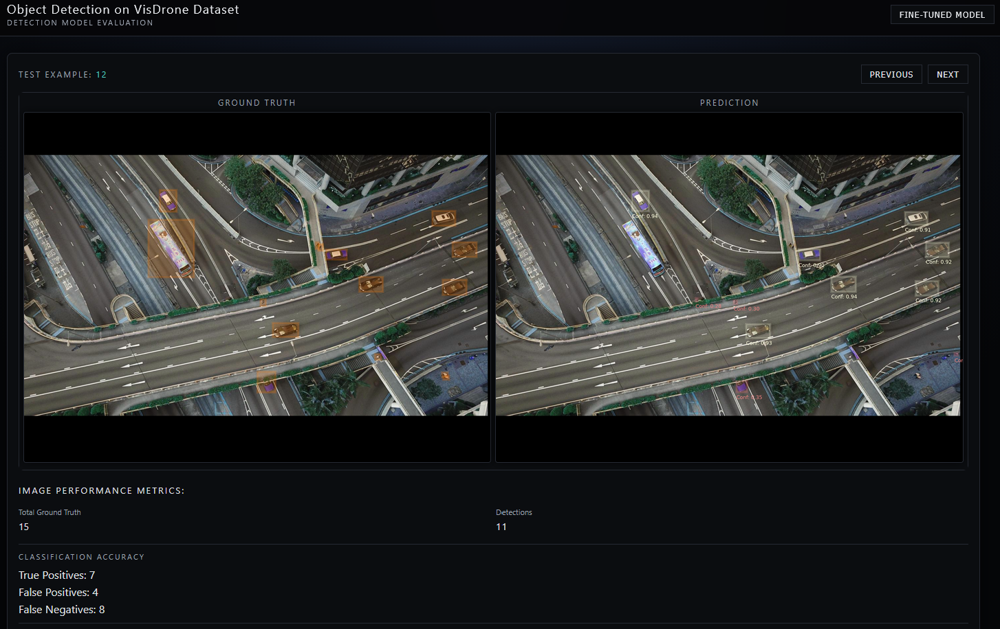

# Dominion Dynamics Submission:<br>Aerial Object Detection and Model Adaptation



## Context and Summary
The intent of this project is to finetune a pretrained object detection model on a dataset
of aerial photographs, evaluate the finetuned model and display the results in a report application.

The final output is an output folder containing the following files 
* Model Detections (./detections)
* Ground Truth Images and Detections (./ground_truth)
* Report Files with metrics for each image (./reports)
  * Configuration file to replicate evaluation
  * Model-wide metrics (metrics.json)
  * Performance message, explaining key metrics (performance.log)
  * Precision-Recall Tradeoff Curve (precision_recall_curve.png)

These files are read by the report viewer: a React/Vite application that displays model detections side-by-side
with an associated ground truth.

The demonstration of the report viewer is located in: *./docs/video-demonstration.mp4*

A more in-depth write-up of the project is also available in: *./docs/project_submission_writeup.docx*

### Model Architecture
The finetuned and pretrained model leverage the [YOLO26 Model Architecture](https://arxiv.org/pdf/2509.25164).
This model leverages Convolutional backbone at multiple resolutions, and aggregates predictions without directly suppressing
overlapping bounding boxes. There are custom functions to suppress overlapping detections, and to match predicted detections
with an associated ground truth.

## First Time Setup:

**1. Setup the model environment**
```bash
conda env create -f environment.yaml
conda activate dominion-submission
```

**2. Download the VisDrone Dataset**
```bash
python ./scripts/download_data.py
```


### Workflows:
**Finetune the Detection Model**
1. Modify the configuration files in *./config/finetune_detection_yolo.yaml* and 
*./config/visdrone_data_config.yaml*
2. Run:
```bash
python ./scripts/train_yolo.py
```


**Evaluate the Detection Model**
1. Modify the configuration file: *./config/eval_detection_yolo.yaml*
2. Run:
```bash
python ./scripts/eval.py
```

**Launch the Application Front-End**
1. Modify the folder paths in *./report_viewer/backend.main.py* if the output folders have
been modified
2. Run (Linux):
```bash
chmod +x run_app.sh
./run_app.sh
```
Note: depending on your setup, you may have to launch the endpoint (backend) and front-end in 
two separate terminals. In this case, follow the commands of the shell script manually.
